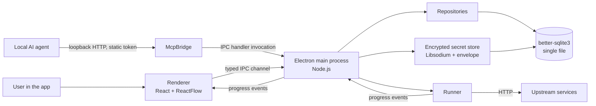

# Architecture

*A high-level overview of how APIWeave's components fit together and how a workflow run moves through the system. This doc is conceptual: no source code references, no class names, just the moving parts.*

## Prerequisites

None. This is a reference doc for users who want to understand the moving parts of APIWeave before diving into feature guides or local MCP setup.

## System Overview

The diagram shows the components that make up APIWeave and the paths a request can take from the user or a local agent to the database and back. The next sections describe each piece in plain language.

## Components

**Renderer** is a React single-page app built on the ReactFlow canvas library. It hosts the visual workflow editor, the variables and environments panels, the secrets page, and the project list. The renderer never talks to the database directly; everything flows through the main process over a typed IPC channel exposed by the preload script.

**Main process** is the Electron main process: a single Node.js process that owns the BrowserWindow, the IPC handler registry, the services, the repositories, the runner, the encrypted secret store, and the local MCP bridge. The main process is the only component that touches the database.

**IPC handler registry** is the typed single-channel router that wires the renderer's calls to the services. The same registry backs the local MCP bridge, so behavior is consistent regardless of which transport called it.

**Services** hold all business logic. The renderer and the MCP bridge both go through the services. The services know nothing about transport; they take typed input, return typed output, and write through the repositories.

**Repositories** are the only place that touches better-sqlite3. Every consumer (handlers, services, runner) goes through repository methods. The schema lives in `app/core/db/migrations/`.

**Runner** is the in-process execution engine. The `RunScheduler` claims pending runs, the `WorkflowExecutor` walks the node graph, `safe_http` makes the outbound HTTP calls with SSRF guards, and `dynamic_functions` evaluates the placeholder functions. Progress is streamed back to the renderer over IPC as the run advances.

**Encrypted secret store** is a tightly scoped layer inside the main process. It accepts Libsodium sealed-box submissions on the write path, unwraps them with the scope's private key, and re-encrypts the plaintext under a per-install keyfile. On the read path, it resolves the local scope chain (selected environment, then the user's local store) and returns decrypted values only to the runtime that needs them. The masking layer scrubs the value before any persistence. The secret store has no read API for stored values that can be reached by a user. Secret values are per-user and never synced, even when teams share config.

**Local MCP bridge** is an opt-in loopback HTTP server bound to `127.0.0.1`. It exposes the IPC handler registry as a second transport, so local AI agents on the same machine can drive the app. The bridge uses a static per-install token for auth. The bridge is off by default; until you enable it, nothing is listening on any port.

## Resource Model

APIWeave is a local-first app built around six resource types, organized into orgs and teams. Every resource lives in the local SQLite database on your machine. An **org** is the top-level container for your work; a **team** is a group inside an org that shares workflows, environments, and projects. Orgs and teams are a local structure — no account is required to use them. Optional APIWeave Cloud sync turns on when you sign in with a Cloud account: it syncs test structure (workflows, environments, projects, and secret references) across machines and lets multiple people collaborate in shared Cloud Workspaces. The local and Cloud names map — a desktop **org** corresponds to a Cloud **Team**, and a desktop **team** corresponds to a Cloud **Workspace**. Cloud never builds or runs tests, and it never holds run history or secret values.

| Resource | Visible to | Owner |
|----------|-----------|-------|
| Project | Your local team | The team it belongs to |
| Workflow | Your local team | The project it belongs to |
| Environment | Your local team | The team |
| Secret (workspace) | Workflows in your local team container | Your workspace (per-user across machines, never synced) |
| Secret (environment) | Workflows that select the environment | The environment |
| Run | You | The workflow or project that produced it |

Secrets are the one resource that is never shared: even when structure syncs through Cloud, each desktop keeps its own secret values and run history locally. Cloud carries no outside collaborators, invites, service tokens, or audit log on the desktop side; cross-machine collaboration and Cloud Workspace membership are handled by the optional Cloud account, not the local model. The desktop app remains single-user on this machine when no Cloud account is signed in.

## Data Flow

A user clicking **Run** in the canvas triggers this sequence:

1. The renderer sends a typed IPC call to the main process with the workflow id and the selected environment id.
2. The main process validates the workflow and the environment, creates a `Run` record with a `pending` status, and enqueues the run with the `RunScheduler`.
3. The `RunScheduler` claims the run, the `WorkflowExecutor` walks the node graph from Start, and `safe_http` makes the outbound HTTP calls.
4. Each completed node is persisted through the run repository. The masking layer scrubs every resolved secret value before persistence, so the run history never holds plaintext.
5. Progress events are streamed from the main process to the renderer over IPC. The renderer updates node colors and result payloads in real time. No polling.
6. When the run reaches a terminal state, the run repository records the final status and the renderer marks the run complete.

A local AI agent calling through the MCP bridge follows the same path. The agent's tool call is mapped to an IPC handler invocation, the rest of the pipeline is identical, and the agent sees the same progress events the renderer would.

## Request Lifecycle

A single node execution follows a predictable lifecycle inside the engine:

- **Resolve scope**: confirm the workflow, the selected environment, and the variables.
- **Resolve secrets**: walk the scope chain (environment, then your local workspace store) for each `{{secrets.NAME}}` placeholder. The resolved values never leave the runtime path.
- **Resolve placeholders**: substitute variables, environment variables, previous node results, and dynamic functions in the node's configuration.
- **Execute**: perform the node's action (an HTTP call, a delay, an assertion check, and so on).
- **Extract**: capture values from the response into workflow variables for downstream nodes.
- **Mask and persist**: scrub every resolved secret value from the result, then store the scrubbed node result so the renderer can render it and so a future run can resume from this point.

If a node fails, the engine records the failure and consults the workflow's `continueOnFail` setting to decide whether to stop or move on to the next branch.

## Storage

The SQLite database holds everything APIWeave needs to keep working across page reloads and app restarts:

- **Projects**: ordered groups of workflows that run together.
- **Workflows**: node graphs, edges, variables, and per-workflow settings.
- **Runs**: execution history, per-node results, and overall status.
- **Environments**: variable maps, scope, and any pinned OpenAPI/Swagger URL.
- **Secrets**: scope, metadata, key id, and envelope-encrypted ciphertext. No plaintext, no read API.
- **Runner state**: pending runs, scheduled runs, and the resume lineage links that make repeated resume safe.

Large response payloads live in a separate blob table so they don't bloat the main records. The renderer reads them on demand.

## External Surfaces

APIWeave exposes two surfaces, both local:

- **Typed IPC channel** between the renderer and the main process. The channel is exposed to the renderer through the preload script and is the single point of contact for every server-side operation.
- **Local MCP bridge** at `http://127.0.0.1:<port>/mcp` for AI agents on the same machine. The bridge is opt-in, uses a static per-install token, and is the only network surface the app exposes. There is no remote trigger, no webhook, no public port.

## Related

- [Documentation Hub](../README.md)
- [Concepts](../getting-started/concepts.md)
- [Workflows and Nodes](../features/workflows-and-nodes.md)
- [Projects](../features/projects.md)
- [Environments and Secrets](../features/environments-and-secrets.md)
