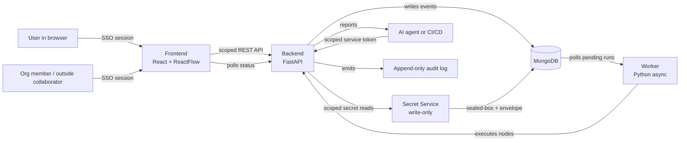

# Architecture

*A high-level overview of how APIWeave 2.0's components fit together and how a workflow run moves through the system. This doc is conceptual: no source code references, no class names, just the moving parts.*

## Prerequisites

None. This is a reference doc for users who want to understand the moving parts of APIWeave 2.0 before diving into feature guides or CI/CD setup.

## System Overview



The diagram shows the components that make up APIWeave 2.0 and the paths a request can take from the browser or an agent to the database and back. The next sections describe each piece in plain language.

## Components

**Frontend** is a React single-page app built on the ReactFlow canvas library. It hosts the visual workflow editor, the variables and environments panels, the org and workspace switcher, the secrets page, the protection panel, and the audit log viewer. The frontend never talks to the database directly; everything flows through the backend's scoped REST API.

**Backend** is a FastAPI service. It serves the scoped REST API at `/api/orgs/{orgSlug}/...`, `/api/users/me/...`, and `/api/workspaces/{workspaceSlug}/...`, mounts the MCP server at `/mcp`, validates scoped service tokens, and stores organizations, workspaces, projects, workflows, runs, environments, secrets, protection, and audit events in the database.

**Worker** is a Python async process. It polls the database for runs that are waiting to execute, then drives each run through the node graph against the selected environment and the resolved secret set. The worker uses the same execution engine the backend uses for synchronous runs, so behavior stays consistent regardless of who started the run.

**MongoDB** is the system of record. It stores organizations, teams, workspaces, members, projects, workflows, runs, environments, secrets (as envelope-encrypted ciphertext), service tokens, protection policies, and the append-only audit log. All four components read and write through it, but only the backend and worker should ever write to it from application code.

**Secret Service** is a tightly scoped layer inside the backend. It accepts Libsodium sealed-box submissions on the write path, unwraps them with the scope's private key, and re-encrypts the plaintext under a per-instance master key. On the read path, it resolves the override chain (selected environment, then workspace, then organization), returns decrypted values only to the runtime that needs them, and relies on the masking layer to scrub the value before any persistence. The secret service has no read API for stored values that can be reached by a user.

**Audit Service** is the append-only event log. Every meaningful action (member change, secret resolution, environment activation, protection decision, project export, service-token creation, webhook delivery) writes an event. The audit log is queryable through the audit page and exports to JSON for offline retention.

## Resource Model

APIWeave 2.0 is a multi-tenant platform built around five resource types. Every resource lives at a specific scope, and every scope has a slug used in URLs.

| Resource | Scopes | Owner |
|----------|--------|-------|
| Organization | one per instance | instance |
| Workspace | personal or organization-owned | user or organization |
| Project | workspace-scoped | workspace |
| Workflow | workspace-scoped | workspace |
| Environment | user, organization, or workspace | scope owner |
| Secret | user, organization, workspace, or environment | scope owner |
| Service Token | organization or workspace | scope owner |
| Audit Event | organization, workspace, or environment | scope owner |

Every URL follows a GitHub-like shape:

```text
/personal/workflows                           # current user's personal workspace
/:orgSlug                                    # organization home
/:orgSlug/:workspaceSlug/workflows            # organization-owned workspace
/:orgSlug/:workspaceSlug/settings/secrets     # secrets page for a workspace
/:orgSlug/:workspaceSlug/audit                # audit log for a workspace
```

## Data Flow

A user clicking Run in the canvas triggers this sequence:

1. The frontend sends a run request to the backend with the workflow id, the selected environment id, and the workspace context. The request carries the SSO session cookie and the CSRF token.
2. The backend validates the workflow, the environment, and the actor's permission to run. For a protected environment, the backend creates a `pending approval` record and the run waits.
3. Once approved (or if the environment is not protected), the backend creates a run record with a `pending` status and returns a run identifier to the frontend.
4. The worker notices the pending run and claims it.
5. The worker hands the run to the execution engine, which resolves the secret set against the override chain, walks the node graph in order, and applies parallel branches where the graph allows.
6. Each node's result is written back to the database as soon as it finishes. The masking layer scrubs every resolved secret value before persistence, so the run history never holds plaintext.
7. The frontend polls the backend for run status and updates the canvas with live node colors and result payloads.

A webhook, MCP call, or CI/CD trigger follows the same path. The trigger is the only thing that changes, and every trigger authenticates with a scoped service token.

## Request Lifecycle

A single node execution follows a predictable lifecycle inside the engine:

- **Resolve scope**: confirm the workflow, the selected environment, and the workspace. For protected environments, confirm the run is approved or the service token is on the bypass allowlist.
- **Resolve secrets**: walk the override chain (env > workspace > org) for each `{{secrets.NAME}}` placeholder. User personal secrets participate only when the workspace or environment has an explicit binding record. The resolved values never leave the runtime path.
- **Resolve**: substitute placeholders for variables, environment variables, previous node results, and dynamic functions in the node's configuration.
- **Execute**: perform the node's action (an HTTP call, a delay, an assertion check, and so on).
- **Extract**: capture values from the response into workflow variables for downstream nodes.
- **Mask and persist**: scrub every resolved secret value from the result, then store the scrubbed node result so the frontend can render it and so a future run can resume from this point.

If a node fails, the engine records the failure and consults the workflow's `continueOnFail` setting to decide whether to stop or move on to the next branch.

## Storage

The database holds everything APIWeave needs to keep working across page reloads and server restarts:

- **Organizations, teams, members, outside collaborators, invites**: the multi-tenant model.
- **Workspaces**: the per-tenant container for resources.
- **Projects**: ordered groups of workflows that run together.
- **Workflows**: node graphs, edges, variables, and per-workflow settings.
- **Runs**: execution history, per-node results, and overall status.
- **Environments**: variable maps, scope, allowlist for organization environments, and protection policies for workspace environments.
- **Secrets**: scope, metadata, key id, and envelope-encrypted ciphertext. No plaintext, no read API.
- **Service tokens**: scope, permission set, expiry, and revocation status. The raw token is never stored.
- **Audit events**: append-only event log with actor, action, scope, resource, and context.

Large response payloads are stored in a separate object store so they don't bloat the main records. The frontend reads them on demand.

## External Surfaces

APIWeave exposes three surfaces for tools and pipelines:

- **REST API** at `/api/*` for the frontend and for first-party integrations. Browser callers authenticate through an SSO session and a CSRF token. Machine callers authenticate with a scoped service token. The path shape is `/api/orgs/{orgSlug}/workspaces/{workspaceSlug}/...` for workspace resources and `/api/users/me/...` for personal resources.
- **MCP** at `/mcp` for AI coding agents such as Claude, Cursor, and opencode. Authentication is by scoped service token, and every tool operates against an explicit scope. Read and export tools redact persisted secrets in their responses.
- **Scoped webhooks** for CI/CD systems like GitHub Actions, GitLab CI, and Jenkins. Authentication is by scoped service token bound to a workspace.

## Related

- [Documentation Hub](../README.md)
- [Concepts](../getting-started/concepts.md)
- [Workflows and Nodes](../features/workflows-and-nodes.md)
- [Projects](../features/projects.md)
- [Environments and Secrets](../features/environments-and-secrets.md)
- [Audit Log](../operations/audit.md)
