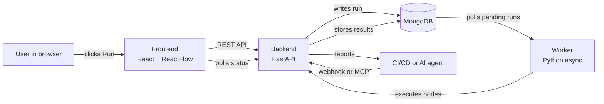

# Architecture

*A high-level overview of how APIWeave's components fit together and how a workflow run moves through the system. This doc is conceptual: no source code references, no class names, just the moving parts.*

## Prerequisites

None. This is a reference doc for users who want to understand the moving parts of APIWeave before diving into feature guides or CI/CD setup.

## System Overview

The diagram shows the four components that make up APIWeave and the paths a request can take from the browser to the database and back. The next sections describe each piece in plain language.

## Components

**Frontend** is a React single-page app built on the ReactFlow canvas library. It hosts the visual workflow editor, the variables and environments panels, and the run results viewer. The frontend never talks to the database directly; everything flows through the backend's REST API.

**Backend** is a FastAPI service. It serves the REST API at `/api/*`, mounts the MCP server at `/mcp`, validates incoming webhooks, and stores workflows, runs, and supporting records in the database. Run requests are accepted here and queued for the worker.

**Worker** is a Python async process. It polls the database for runs that are waiting to execute, then drives each run through the node graph. The worker uses the same execution engine the backend uses for synchronous runs, so behavior stays consistent regardless of who started the run.

**MongoDB** is the system of record. It stores workflows, runs, environments, collections, webhooks, and execution logs. All four components read and write through it, but only the backend and worker should ever write to it from application code.

## Data Flow

A user clicking Run triggers this sequence:

1. The frontend sends a run request to the backend.
2. The backend validates the workflow, creates a run record with a `pending` status, and returns a run identifier to the frontend.
3. The worker notices the pending run and claims it.
4. The worker hands the run to the execution engine, which walks the node graph in order and applies parallel branches where the graph allows.
5. Each node's result is written back to the database as soon as it finishes, so partial results are visible while a run is still in progress.
6. The frontend polls the backend for run status and updates the canvas with live node colors and result payloads.

A webhook or MCP call follows the same path. The trigger is the only thing that changes.

## Request Lifecycle

A single node execution follows a predictable lifecycle inside the engine:

- **Resolve**: substitute placeholders like environment variables, workflow variables, and previous-node references in the node's configuration.
- **Execute**: perform the node's action (an HTTP call, a delay, an assertion check, and so on).
- **Extract**: capture values from the response into workflow variables for downstream nodes.
- **Persist**: store the node result so the frontend can render it and so a future run can resume from this point.

If a node fails, the engine records the failure and consults the workflow's `continueOnFail` setting to decide whether to stop or move on to the next branch.

## Storage

The database holds everything APIWeave needs to keep working across page reloads and server restarts:

- **Workflows**: node graphs, edges, variables, and per-workflow settings.
- **Runs**: execution history, per-node results, and overall status.
- **Environments**: variable and secret definitions that workflows reference at run time.
- **Collections**: ordered groups of workflows that can be exported, imported, and run together.
- **Webhooks**: URLs, tokens, and HMAC secrets used by external systems to trigger runs.
- **Logs**: execution traces kept for debugging and audit.

Large response payloads are stored in a separate object store so they don't bloat the main records. The frontend reads them on demand.

## External Surfaces

APIWeave exposes three surfaces for tools and pipelines:

- **REST API** at `/api/*` for the frontend and for first-party integrations. Browser callers authenticate through an SSO session; machine callers authenticate with a token.
- **MCP** at `/mcp` for AI coding agents such as Claude, Cursor, and opencode. Authentication is by bearer API key.
- **Webhook URLs** for CI/CD systems like GitHub Actions, GitLab CI, and Jenkins. Authentication is by token plus HMAC signature in production.

## Related

- [Documentation Hub](../README.md)
- [Concepts](../getting-started/concepts.md)
- [Workflows and Nodes](../features/workflows-and-nodes.md)
- [Webhooks](../features/webhooks.md)
